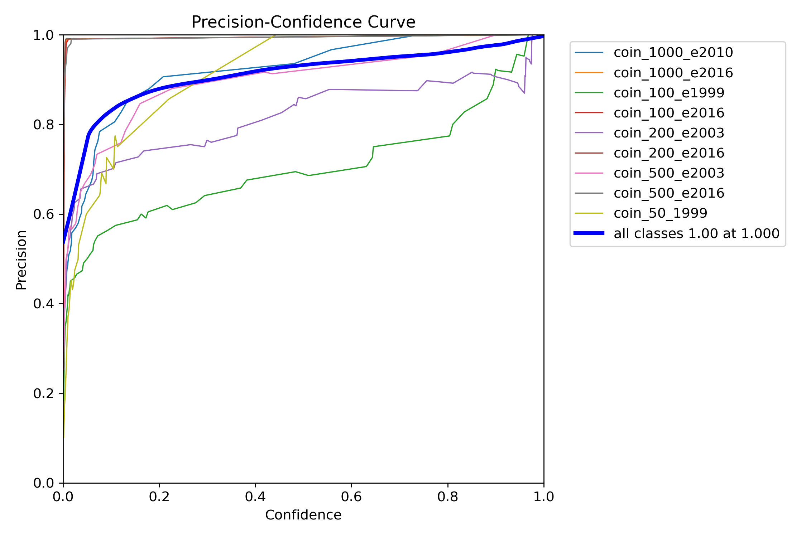
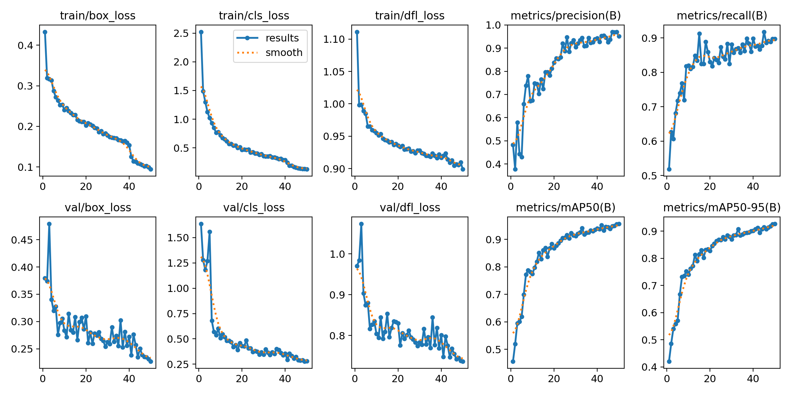
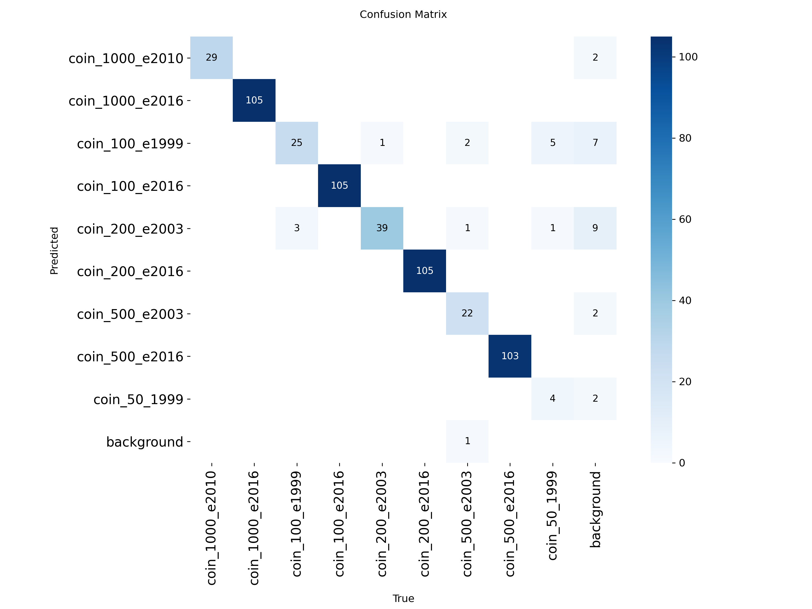

# Deteksi Uang Koin Menggunakan OpenCV Python

## Background

Along with the advancement of digital image processing technology, various computer-based automated solutions are now widely applied in everyday life, including in recognizing physical objects such as coins. In the context of microfinance, such as in small businesses, manual parking systems, or money changers, the process of identifying the value of coins is often still done manually. This is not only time-consuming, but also prone to human error. 
The use of computer vision technology such as OpenCV provides a fast, efficient, and reliable alternative to automatically recognize and classify coin denominations. This project aims to develop a system that is able to detect and classify rupiah coins with denominations of Rp100, Rp200, Rp500, and Rp1000 using a specially trained YOLOv8 model, and integrate it with OpenCV to automatically calculate the total value and display the results visually on a webcam streaming video. 
The total value of the money is then calculated automatically and displayed in real-time.

## 🎯 Tujuan
- Mendeteksi dan mengklasifikasikan jenis koin.
- Memberikan Akurasi (confidence) terhadap hasil klasifikasi.
- Menyediakan informasi jumlah total terhadap koin yang terdeteksi.
- Menampilkan visual bounding box untuk mempermudah pengguna mengenali koin yang terdeteksi.
- Mengimplementasikan sistem dalam aplikasi web yang mudah digunakan.

---

## 📁 Dataset
- Dataset: Coin Rupiah Detection Computer Vision Project 
- Sumber: [Roboflow - dataset Coin Rupiah Detection Computer Vision Project by Chandras](https://universe.roboflow.com/chandras/coin-rupiah-detection)

---

## 🛠 Tools & Teknologi
- *Bahasa Pemrograman:* Python  
- *Metode:* Yolov8n
- *Visualisasi:* CV, Matplotlib, gradio
- *Teknik:* Image preprocessing, feature extraction, classification, bounding box detection  

---

## 🚀 Fitur Sistem
1. *Upload Gambar:* Pengguna dapat mengunggah gambar coin.
2. *Prediksi Koin:*
   - Jenis koin akan ditampilkan secara otomatis pada layar.
   - Menampilkan tingkat akurasi.
3. *Visualisasi Bounding Box:*
   - Area koin ditandai dengan bounding.
   - Label jenis koin dan confidence ditampilkan di dalam gambar.
4. *Penjumlahan koin terdeteksi:*
   - Misalnya: "Terdapat 5 buah koin 200, maka hasil akan berjumlah 1000."
5. *Antarmuka Web Sederhana:*
   - Menampilkan hasil klasifikasi, confidence, gambar asli + bounding box, dan penanganan.

---

## 📈 Detail Progress 
- ✅ Data preprocessing dan augmentasi gambar selesai.
- ✅ Model yolo dilatih dengan akurasi validasi hingga *92%*.
- ✅ Implementasi bounding box CV selesai.
- ✅ Sistem memberikan output klasifikasi, confidence, jumlah koin, dan gambar hasil.

## 🚀 Hasil 
- ### Grafik akurasi dan loss model
  

   
   
  

 
- ### Confusion Matrix
  

  
  

  ---
## Libraries Used
- cv2 → To access webcam, display video, draw detection boxes, and text.
- ultralytics → To load and run YOLOv8 model.
